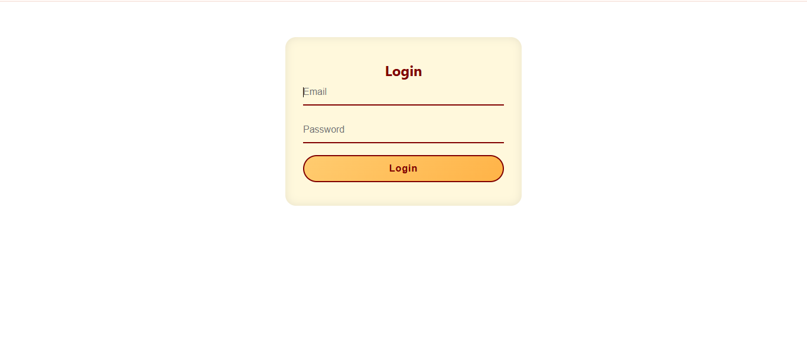
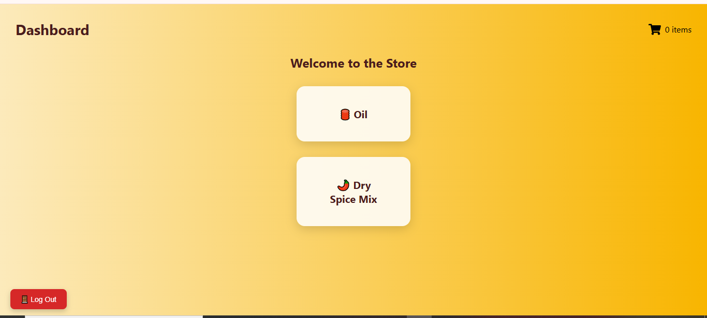
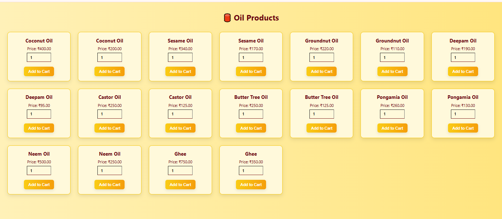
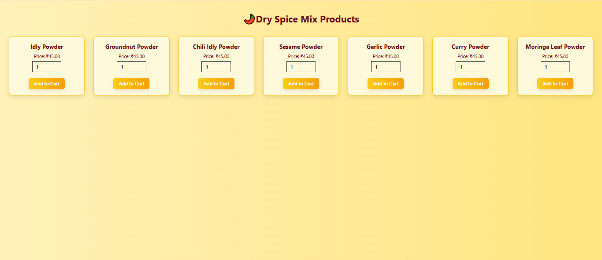
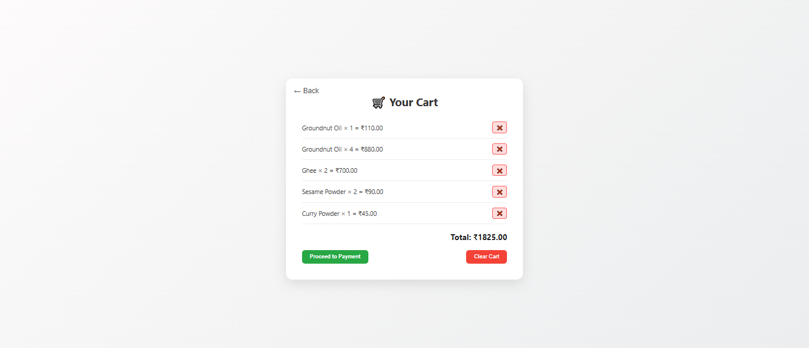
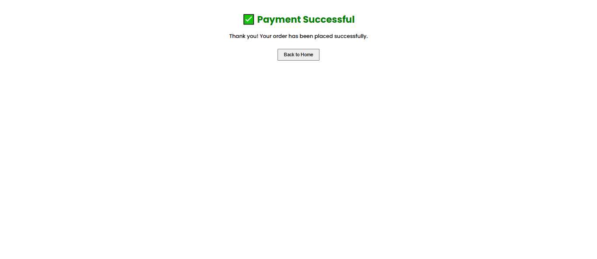

#  Sri Senthur Oil – E-Commerce Web Application
               
A complete full-stack e-commerce platform built for Sri Senthur Oil, enabling customers to browse and order products online.
It features secure admin controls, product management, and a responsive user interface.

## 📌 Project Highlights

        🖥️ Frontend: React.js, React Router
        🔐 Backend: Node.js, Express.js, JWT for authentication
        📂 Database: MySQL
        ⚙️ Tools: Axios, dotenv, nodemon
        📁 Project Structure: Organized into Frontend and Backend directories
        🔐 Security: Passwords and DB credentials managed securely using .env files

## 📁 Project Directory Structure
                
                  E-CommerceWeb/
                  │
                  ├── Backend/
                  │   └── sriSenthurOil/
                  │       ├── controllers/
                  │       ├── routes/
                  │       ├── src/
                  │       ├── db.js
                  │       ├── server.js
                  │       └── .env
                  │
                  └── FrontEnd/
                      └── oilstore/
                          ├── public/
                          ├── src/
                          ├── App.js
                          └── index.js
## 🚀 Getting Started

### ✅ Prerequisites

  Make sure you have installed:

          Node.js (v18+ recommended)
          MySQL Server
          npm (comes with Node.js)
### ⚙️ Backend Setup

1. Navigate to the backend folder:

       cd Backend/sriSenthurOil
2. Install dependencies:

       npm install
3. Configure your .env file:

   Create a file named .env in Backend/sriSenthurOil/ with the following contents:

       DB_HOST=localhost

       DB_USER=your_mysql_user

       DB_PASS=your_mysql_password

       DB_NAME=your_database_name
4. Start the backend server:

       node server.js

### 🌐 Frontend Setup

1. Navigate to the frontend folder:

        cd FrontEnd/oilstore
2. Install dependencies:

        npm install
3. Start the frontend development server:
 
        npm start

React app will typically run on http://localhost:3000

## 🔐 Admin Access :
To access admin-specific features, you may need to log in via special credentials defined in admin.js.
Ensure this file is properly secured and not exposed in production deployments.

## 🛠️ Technologies Used

### Frontend

    -> React.js

    -> React Router

    -> Axios

    -> HTML5, CSS3

### Backend

    -> Node.js

    -> Express.js

    -> JWT for Authentication

    -> dotenv

    -> MySQL

## 📸 Screenshots 
<table>
  <tr>
  <td align="center">

    <b>HomePage</b></td>
  <td align="center">

  <b>RegisterPage</b></td>
  </tr>
  <tr>
  <td align="center">

    <b>LoginPage</b></td>
  <td align="center">

  <b>Dashboard</b></td>
  </tr>
   <tr>
  <td align="center">

    <b>Oil Category Page</b></td>
  <td align="center">

  <b>Dry Mix Spices Category Page</b></td>
  </tr>
   <tr>
  <td align="center">

    <b>CartPage</b></td>
  <td align="center">

  <b>Mock Payment SuccessPage</b></td>
  </tr>
   <tr>
  <td align="center">

    <b>Stock in Pie Chart</b></td>
  <td align="center">

  <b>Add New Products</b></td>
  </tr>
   <tr>
  <td align="center">

    <b>Increase or Delete the Stock</b></td>
  </tr>
</table>
## 📝 To-Do / Future Enhancements
 
     -> Add payment integration (e.g., Razorpay or Stripe)

     -> Improve responsive design

     -> Add product search and filtering

    -> Deploy on cloud (e.g., Vercel for frontend, Render or Railway for backend)

  ## 🔗 Project Links

- [GitHub Repository](https://github.com/PreethiM08/E-CommerceWeb)

